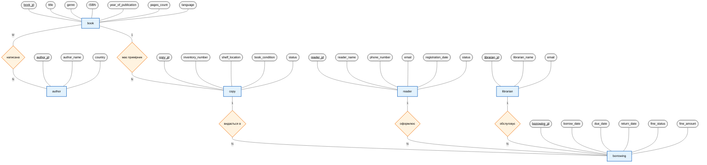

## ER-діаграма (нотація Чена)

```mermaid
flowchart TD
    classDef entity fill:#e3f2fd,stroke:#1565c0,stroke-width:2px,color:#000
    classDef rel fill:#fff3e0,stroke:#ef6c00,stroke-width:2px,color:#000
    classDef attr fill:#f5f5f5,stroke:#616161,stroke-width:1px,color:#000

    %% Сутності (Прямокутники)
    BOOK[book]:::entity
    AUTHOR[author]:::entity
    COPY[copy]:::entity
    READER[reader]:::entity
    LIBRARIAN[librarian]:::entity
    BORROWING[borrowing]:::entity

    %% Зв'язки (Ромби)
    REL_BA{написана}:::rel
    REL_BC{має примірник}:::rel
    REL_CB{видається в}:::rel
    REL_RB{оформлює}:::rel
    REL_LB{обслуговує}:::rel

    %% Кардинальність зв'язків
    BOOK ---|M| REL_BA
    REL_BA ---|N| AUTHOR

    BOOK ---|1| REL_BC
    REL_BC ---|N| COPY

    COPY ---|1| REL_CB
    REL_CB ---|N| BORROWING

    READER ---|1| REL_RB
    REL_RB ---|N| BORROWING

    LIBRARIAN ---|1| REL_LB
    REL_LB ---|N| BORROWING

    %% Атрибути book (Овали)
    b_id(["b̲o̲o̲k̲_̲i̲d̲"]):::attr --- BOOK
    b_title([title]):::attr --- BOOK
    b_genre([genre]):::attr --- BOOK
    b_isbn([ISBN]):::attr --- BOOK
    b_year([year_of_publication]):::attr --- BOOK
    b_pages([pages_count]):::attr --- BOOK
    b_lang([language]):::attr --- BOOK

    %% Атрибути author
    a_id(["a̲u̲t̲h̲o̲r̲_̲i̲d̲"]):::attr --- AUTHOR
    a_name([author_name]):::attr --- AUTHOR
    a_country([country]):::attr --- AUTHOR

    %% Атрибути copy
    c_id(["c̲o̲p̲y̲_̲i̲d̲"]):::attr --- COPY
    c_inv([inventory_number]):::attr --- COPY
    c_shelf([shelf_location]):::attr --- COPY
    c_cond([book_condition]):::attr --- COPY
    c_stat([status]):::attr --- COPY

    %% Атрибути reader
    r_id(["r̲e̲a̲d̲e̲r̲_̲i̲d̲"]):::attr --- READER
    r_name([reader_name]):::attr --- READER
    r_phone([phone_number]):::attr --- READER
    r_email([email]):::attr --- READER
    r_reg([registration_date]):::attr --- READER
    r_stat([status]):::attr --- READER

    %% Атрибути librarian
    l_id(["l̲i̲b̲r̲a̲r̲i̲a̲n̲_̲i̲d̲"]):::attr --- LIBRARIAN
    l_name([librarian_name]):::attr --- LIBRARIAN
    l_email([email]):::attr --- LIBRARIAN

    %% Атрибути borrowing
    br_id(["b̲o̲r̲r̲o̲w̲i̲n̲g̲_̲i̲d̲"]):::attr --- BORROWING
    br_bdate([borrow_date]):::attr --- BORROWING
    br_ddate([due_date]):::attr --- BORROWING
    br_rdate([return_date]):::attr --- BORROWING
    br_fstat([fine_status]):::attr --- BORROWING
    br_famt([fine_amount]):::attr --- BORROWING
```
